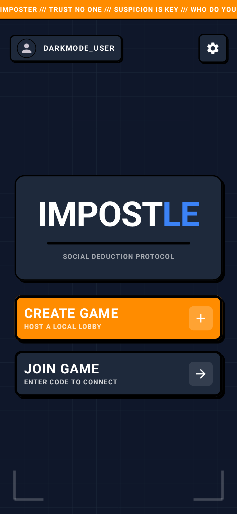
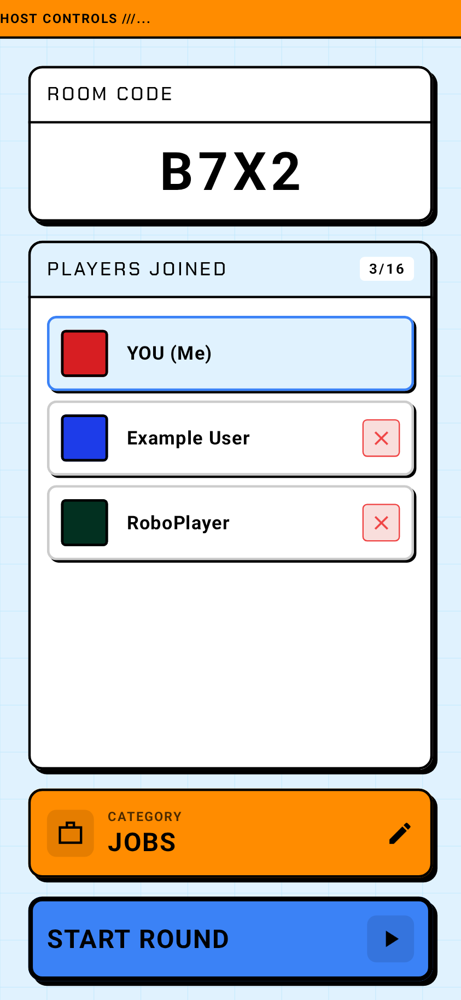
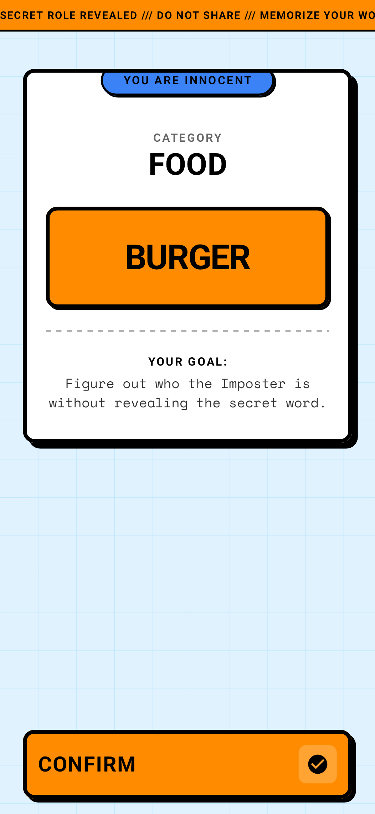
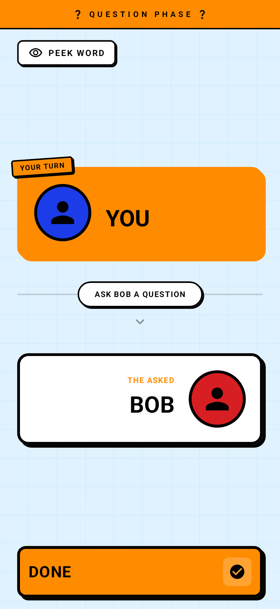
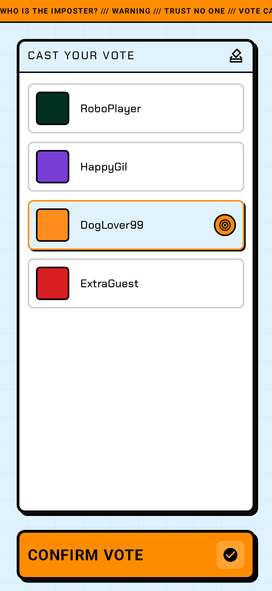
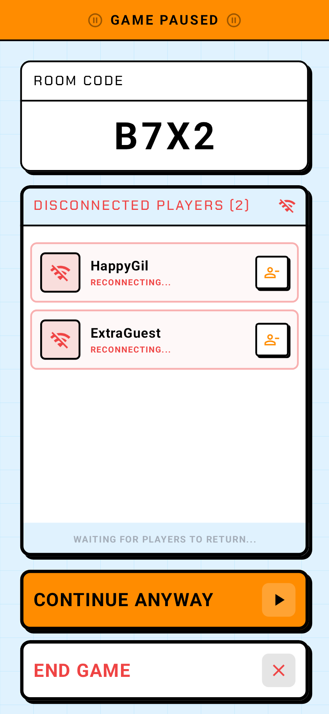

# Impostle <!-- omit in toc -->

Impostle is a decentralized, peer-to-peer social deduction game (similar to *Spyfall*) built entirely natively for Android. It operates completely offline over a local Wi-Fi network, utilizing Android's **Network Service Discovery (NSD)** for zero-configuration matchmaking and **Raw TCP Sockets** for real-time, bidirectional game state synchronization.

## Table of Contents <!-- omit in toc -->

| Introduction                   | System Architecture                             | Networking & Protocols                                     | Engineering                           |
| :------------------------------------- | :------------------------------------------------ | :----------------------------------------------------------- | :-------------------------------------------------- |
| [Features](#features)                | [Tech Stack](#tech-stack)                       | [Establishment](#how-a-game-session-is-established)       | [Technical Highlights](#key-technical-highlights) |
| [Screenshots](#screenshots)          | [Architecture Overview](#architecture-overview) | [UDF Communication](#communication-during-a-game-session) | [Architecture Decisions](#architecture-decisions) |
| [Overview](#overview)                | [Design Patterns](#design-patterns)             | [Loopback Handling](#how-host-actions-are-handled)        | [Testing Strategy](#testing-strategy)            |
| [Getting Started](#getting-started) | [Structure](#project-structure)                | [Reconnection](#disconnection-and-reconnection-handling)  | [Roadmap](#roadmap--future-improvements)         |


## Features

*   **Zero-Configuration Matchmaking:** Automated lobby discovery using Android **Network Service Discovery (NSD)**. Connect to local games instantly using only a 4-digit room code, no manual IP entry required.
*   **On-Device Server Hosting:** The host device functions as the central authority, running a multi-threaded **Ktor TCP server** as a foreground service. This allows for a completely serverless, "LAN-party" experience.
*   **Resilient Session Recovery:** Implemented a robust "Ghosting" system. If a player drops connection, the game **auto-pauses** and preserves state for a seamless **UUID-based reconnection**.
*   **Sanitized Data Synchronization:** Anti-cheat logic enforced at the protocol level. The server scrubs sensitive data (like the secret word or imposter identity) from network payloads based on the recipient's assigned role.
*   **Cyber-Brutalist Design System:** Custom Jetpack Compose UI with native Light and Dark mode support.


## Screenshots

<h3 align="center">Core Gameplay Loop</h3>
<p align="center"><i>(Selected snippets; not representative of the full gameplay flow)</i></p>
<table align="center">
  <tr>
    <td align="center" width="33%"></td>
    <td align="center" width="33%"></td>
    <td align="center" width="33%"></td>
  </tr>
  <tr>
    <td align="center"><b>Main Menu (Dark Theme)</b><br/>DataStore Persistence</td>
    <td align="center"><b>Lobby Setup</b><br/>NSD & TCP Discovery</td>
    <td align="center"><b>Role Reveal</b><br/>Distribution Logic</td>
  </tr>
</table>

<h3 align="center">Dynamic State & Resilience</h3>
<table align="center">
  <tr>
    <td align="center" width="33%"></td>
    <td align="center" width="33%"></td>
    <td align="center" width="33%"></td>
  </tr>
  <tr>
    <td align="center"><b>Question Phase</b><br/>Turn-based Logic</td>
    <td align="center"><b>Voting System</b><br/>Real-time Updates</td>
    <td align="center"><b>Active Pause</b><br/>Connection Recovery</td>
  </tr>
</table>


## Overview

Building a multiplayer game usually relies on a centralized backend server (REST/WebSockets). Impostle shifts the entire backend onto the Android device itself.

When a user creates a lobby, their device silently launches a multi-threaded TCP server via a Foreground Service. Other players dynamically discover this host on the local network (NSD) using a 4-digit code. The game then enforces a strict, unidirectional data flow to keep all clients perfectly synchronized, handling complex edge cases like mid-game reconnections.


## Tech Stack

*   **Language:** Kotlin
*   **UI Toolkit:** Jetpack Compose (Reusable Components, Theme (Light/Dark), Custom Modifiers)
*   **Architecture:** Clean Architecture, MVI, Repository Pattern, Strategy Pattern, Template Method Pattern
*   **Concurrency:** Kotlin Coroutines, `StateFlow`, `SharedFlow`, `supervisorScope`
*   **Networking:** Android NSD Manager (Registering, Discovering, Resolving), Ktor Network (TCP Sockets)
*   **Dependency Injection:** Dagger Hilt
*   **Testing:** JUnit 4, MockK, CashApp Turbine, `kotlinx-coroutines-test`
*   **Serialization:** `kotlinx.serialization` (JSON)
*   **Local Storage:** Jetpack DataStore (Preferences)

## Architecture Overview

<p align="center">
  
  <br>
  <b>Figure 1:</b> <i>High-level Service Discovery and Data Flow Architecture.</i>
</p>


The application follows **Clean Architecture** combined with **MVI** and **Unidirectional Data Flow (UDF)**.

*   **Presentation Layer:** Compose UI and ViewModels. ViewModels emit Intent/Events and observe Screen State.
*   **Domain Layer (Pure Kotlin):** Contains the Game Engine, `GameModeStrategy` interfaces, Reducers, and business logic models. It is completely agnostic of Android or Network frameworks.
*   **Data Layer:** Implements Domain interfaces. Handles raw Ktor Socket connections, NSD Manager operations, and Jetpack DataStore persistence.


## Key Technical Highlights

*   **Peer-to-Peer TCP Networking:** Built a custom networking layer using Ktor raw sockets with **length-prefixed framing** to prevent TCP stream fragmentation and guarantee perfect JSON payload delivery.
*   **Host-as-Client Loopback Optimization:** The Host device runs both the Server Engine and a Client UI simultaneously. Instead of routing host traffic through the OS network stack, it bypasses it entirely using an in-memory `LoopbackDataSource` (`MutableSharedFlow`), ensuring zero network overhead.
*   **Scalable Game Logic:** The engine uses Dagger Hilt Multibinding to inject various `GameModeStrategy` implementations. This architecture allows the app to be extended with new game modes (adhering to the Open/Closed Principle) by simply adding a new strategy class, ensuring the `GameServer` remains clean and unmodified.
*   **Session Persistence:** The `SessionManager` uses UUID mapping to allow players to return to a paused game even if their physical IP address changes upon reconnection.
*   **Resilient Coroutine Lifecycles:** Network operations are heavily fortified against edge cases using `supervisorScope` (to isolate client crashes), `withTimeout` (to prevent infinite NSD hanging), and `withContext(NonCancellable)` to guarantee memory-safe socket teardown during sudden coroutine cancellations.
*   **Headless E2E Network Simulation:** Built a custom `InMemoryNetworkRouter` test harness that allows full 30+ player client-server interactions and reconnection edge-cases to be simulated and tested on a single JVM in milliseconds.


## Architecture Decisions
1. **Network Service Discovery (NSD) vs. Wi-Fi Direct**
    *   *Decision:* Use Android's `NsdManager`.
    *   *Rationale:* NSD was selected due to its cross-platform nature, allowing potential iOS support in the future. As a local party game, players are expected to be on the same local network, or the host can provide a hotspot for connectivity.
2. **Ktor Raw Sockets vs. WebSockets / HTTP**
    *   *Decision:* Use raw TCP Sockets with custom JSON framing.
    *   *Rationale:* Lower overhead and latency making it more suitable for a custom messaging protocol.
3. **Loopback Data Source vs. Local Socket**
    *   *Decision:* Use an in-memory `LoopbackDataSource` for the Host.
    *   *Rationale:* Using an actual socket to `127.0.0.1` for the host client would involve redundant serialization and OS network stack overhead. The memory-based flow ensures the host has the most responsive experience possible.
4. **Length-Prefix Framing vs. New Line Protocol**
    * Decision: Implemented length-prefixed framing (readInt -> readFully).
    * Rationale: While a New Line (\n) protocol is simpler, it breaks if message payloads (like an in-game chat) contain actual new lines. Length-prefixing ensures the protocol is extensible for multiline strings.


## Design Patterns

*   **Repository Pattern:** Abstracts the source of data, allowing the Domain layer to remain agnostic of whether it is communicating with a remote socket or local memory.
*   **Combined Strategy & Template Method Patterns:**
    Used to ensure the Game Engine is highly extensible while avoiding code duplication:
    *   **Template Method (Class Level):** Defines the fixed steps of a game round (Setup, Start, Turn End) using inheritance. It lets subclasses alter specific parts of the algorithm while preserving the overall structure.
    *   **Strategy (Object Level):** Uses composition to switch behaviors of `GameServer` at runtime. By supplying different strategies (e.g., `QuestionGameModeStrategy` vs. a future `DescribeGameModeStrategy`) via **Dagger Hilt Multibinding**, the object's behavior can be altered without modifying the engine.


## System Walkthrough

### How a Game Session is Established

<p align="center">
  
  <br>
  <b>Figure 2:</b> <i>Game Session Establishment Sequence Diagram.</i>
</p>


1.  **Host Initiation:** Host creates a game. `GameService` starts. `KtorSocketServer` binds to an open port.
2.  **Advertisement:** `NsdNetworkRegistration` broadcasts `_impostle._tcp.` with the game code (e.g., `Impostle_XYZ9`).
3.  **Discovery:** Client inputs `XYZ9`. `NsdNetworkDiscovery` filters by suffix, resolves the Host's local IP, and initiates a TCP connection.
4.  **Handshake & Sync:** Client sends a `RegisterPlayer` payload. Server broadcasts the updated `PlayerList`.

### Communication During a Game Session
<p align="center">
  
  <br>
  <b>Figure 3:</b> <i>Game Session Unidirectional Data Flow (UDF).</i>
</p>


Once the lobby is formed, the game shifts to a strict **Unidirectional Data Flow (UDF)** where the Server acts as the absolute single source of truth, and Clients act as "dumb terminals":
1. **Client Action:** A user interacts with the Compose UI (e.g., submitting a vote). The ViewModel calls the appropriate `GameClient` method which sends a `ClientMessage` to the `ClientNetworkRepository`.
2. **Network Transport:** The message is serialized into JSON, framed with a length-prefix, and sent over the raw TCP socket.
3. **Server Processing:** `HostServerNetworkRepository` deserializes the JSON and passes it to the `GameServer`'s sequential processing loop.
4. **Strategy Execution:** The message is routed to the active `GameModeStrategy` (e.g., `QuestionGameModeStrategy`). The strategy validates the action against the current `GamePhase` and computes a `GameStateTransition`.
5. **State Broadcast:** The server applies the valid transition, updates its master `GameData`, and generates `ServerMessage` envelopes (Broadcasts or Unicasts) to send back down the TCP pipes.
6. **Client Reducer:** Clients receive the `ServerMessage` and pass it through the pure `ClientStateReducer`, deterministically computing the new local `GameData`. The Compose UI observes this `StateFlow` and reactively recomposes.

### How Host Actions Are Handled
<p align="center">
  
  <br>
  <b>Figure 4:</b> <i>Host-as-Client In-Memory Loopback Using Flow Merging.</i>
</p>

Because the Host device runs both the Server Engine and a Client UI, sending the Host's UI interactions through the local network stack (e.g., connecting to `127.0.0.1`) would introduce unnecessary latency, and serialization overhead.

To solve this, the architecture utilizes **Interface Segregation** and **Flow Merging**:
* **The Loopback Data Source:** The Host's UI uses a `LoopbackClientNetworkRepository` instead of the remote version. Under the hood, this repository simply emits messages into an in-memory `MutableSharedFlow`.
* **Flow Merging:** Inside the `HostServerNetworkRepository`, the incoming message stream is constructed using Kotlin's `merge()` operator. It merges the real Ktor socket `messageEvents` flow with the in-memory `LoopbackDataSource.clientToServer` flow.
* **Direct Delivery:** When the server broadcasts a state update, it checks the `TransportEndpoint` for each player. If the endpoint is `Network`, it serializes and writes to the socket. If the endpoint is `Loopback`, it emits the raw Kotlin object directly to the UI's `serverToClient` flow, achieving instantaneous, zero-cost state updates for the Host.

### Disconnection and Reconnection Handling
<p align="center">
  
  <br>
  <b>Figure 5:</b> <i>Disconnect & Auto-Recovery Sequence Diagram.</i>
</p>

Mobile networks are volatile. To prevent a single dropped Wi-Fi connection from destroying a 10-person lobby, the `SessionManager` implements a robust ghosting and auto-recovery system:
* **Connection Drop:** If a Ktor socket throws an `EOFException` or is closed, the server immediately maps the TCP Client ID to the Domain Player UUID. It emits a `PlayerDisconnected` system event.
* **Game Freeze:** The `SessionManager` marks the player as "Offline" (a Ghost) and safely freezes the game by transitioning the state machine to `GamePhase.Paused`, saving the exact `phaseBeforePause` in memory.
* **Reconnection:** When the dropped player restarts the app and enters the room code, their client sends a `RegisterPlayer` payload containing their *original* UUID.
* **State Sync & Sanitization:** The `SessionManager` detects the returning UUID, maps the new socket connection to it, and generates a `ReconnectionFullStateSync` payload. *Crucially, this payload is sanitized for role privacy* (e.g., if the returning player is the Imposter, the secret word is scrubbed from the sync payload).
* **Auto-Resume:** Once `isEveryoneConnected` evaluates to true, the server broadcasts a `GameResumed` event, and all clients seamlessly revert to `phaseBeforePause` as if nothing happened.

## Testing Strategy

<p align="center">
  
  <br>
  <b>Figure 6:</b> <i>Headless E2E Test Harness.</i>
</p>

This project features a comprehensive, multi-tiered testing architecture, utilizing **MockK**, **Turbine**, and `kotlinx-coroutines-test`.

*   **Headless E2E Simulation:** Built a custom `InMemoryNetworkRouter` and `HeadlessPlayer` test harness. This allows full multi-player client-server interactions, game phases, and complex reconnect loops to be simulated and verified in milliseconds on a single JVM, without needing Android emulators.
*   **Concurrency & Stress Testing:** Explicitly tests race conditions and concurrent state mutations, such as a "thundering herd" of 30+ clients joining instantly, or multiple players submitting votes on the exact same virtual tick.
*   **Reactive Flow Testing:** Validates `StateFlow` emissions and `SharedFlow` navigation events using CashApp's **Turbine**, ensuring strict unidirectional data flow inside all ViewModels.
*   **Deep IO Mocking:** Swaps live sockets for in-memory byte channels to validate low-level JSON framing and lifecycle events (EOF/Closures).

## Project Structure

```text
com.example.nsddemo
├── core/             # Constants, Debugging utils
├── data/
│   ├── local/        # NSD, Ktor TCP, Loopback logic
│   └── repository/   # Repo implementations (Network, Settings)
├── di/               # Hilt Modules (App, Socket, Dispatchers, Strategies)
├── domain/
│   ├── e2e/          # Headless E2E test engine (fakes & router)
│   ├── engine/       # Orchestrators (GameServer, GameClient, GameSession)
│   ├── logic/        # Reducers, Managers, Pair Generators
│   ├── model/        # Sealed classes (Phases, Messages, Data)
│   └── strategy/     # Strategy & Template Method implementations
└── presentation/
    ├── components/   # Brutalist Design System UI elements
    ├── navigation/   # Navigation graph & route mapping
    └── screen/       # ViewModels and Compose Screens
```

## Roadmap / Future Improvements

*   **"Describe" Game Mode:** Utilizing the existing `GameModeStrategy` pattern to add a new game type where players describe words instead of asking questions.


## Getting Started
1.   **Prerequisites:** Android Studio, Android SDK 24+.
2.   **Running Locally:** Clone the repo and build to a physical device. 

**Note**: To test multiplayer functionality, you must run the app on at least two physical devices connected to the same Wi-Fi network (emulators run on isolated virtual networks by default).
